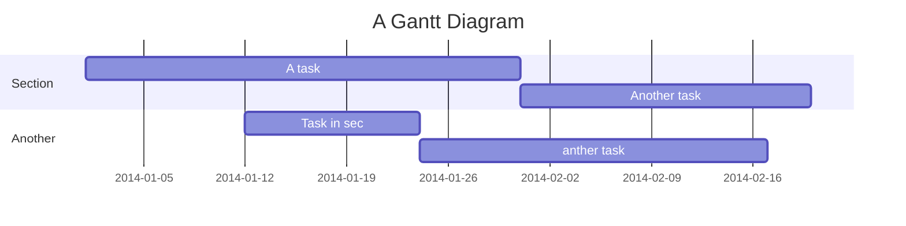

# TEMI Project
###### tags:`Project 2022`


## Table of Contents

[TOC]

## Beginners Guide

If you are a total beginner to this, start here!

1. Visit hackmd.io
2. Click "Sign in"
3. Choose a way to sign in
4. Start writing note!

User story
---

```gherkin=
Feature: Guess the word

  # The first example has two steps
  Scenario: Maker starts a game
    When the Maker starts a game
    Then the Maker waits for a Breaker to join

  # The second example has three steps
  Scenario: Breaker joins a game
    Given the Maker has started a game with the word "silky"
    When the Breaker joins the Maker's game
    Then the Breaker must guess a word with 5 characters
```
> I choose a lazy person to do a hard job. Because a lazy person will find an easy way to do it. [name=Bill Gates]


```gherkin=
Feature: Shopping Cart
  As a Shopper
  I want to put items in my shopping cart
  Because I want to manage items before I check out

  Scenario: User adds item to cart
    Given I'm a logged-in User
    When I go to the Item page
    And I click "Add item to cart"
    Then the quantity of items in my cart should go up
    And my subtotal should increment
    And the warehouse inventory should decrement
```

> Read more about Gherkin here: https://docs.cucumber.io/gherkin/reference/

User flows
---
```sequence
Alice->Bob: Hello Bob, how are you?
Note right of Bob: Bob thinks
Bob-->Alice: I am good thanks!
Note left of Alice: Alice responds
Alice->Bob: Where have you been?
```

> Read more about sequence-diagrams here: http://bramp.github.io/js-sequence-diagrams/

Project Timeline
---


> Read more about mermaid here: http://mermaid-js.github.io/mermaid/

## Appendix and FAQ

:::info
**Find this document incomplete?** Leave a comment!
:::

###### tags: `Templates` `Documentation`

Progress Report
---
3/11
1. 安裝Android Studio
2. 安裝Flutter
3. 參考網址1: https://ithelp.ithome.com.tw/articles/10216013
4. 參考網址2: https://www.youtube.com/watch?v=QV6w2f4e0rU
5. 並已程式給的程式碼來熟悉JAVA語法


3/18
1. 確認temi機器人是否能成功啟動
2. 初步熟悉kotlin語法

3/25 
1. 討論分工
    1. 餐點運輸
        - 協助餐點菜單查詢、點餐
        - 確認餐點後的運送服務
    2. 迎賓客服
        - 各產品功能及價格說明、現貨查詢或協助線上代訂等
        - 介紹購車享回饋與累積和泰 Points、辦卡流程說明、對應 app下載教學等,上述兩種資訊的推播。
        - 
4/1
1. 參加說明會提問是否可將購車合約列印成電子檔和將車子內部造型以temi顯示
2. 更新後的temi無法使用adb連線，已用簡訊詢問temi官方來解決此問題

## 遇見問題

問題1：無法使用adb連線
解決方法：已用簡訊詢問temi官方來解決此問題